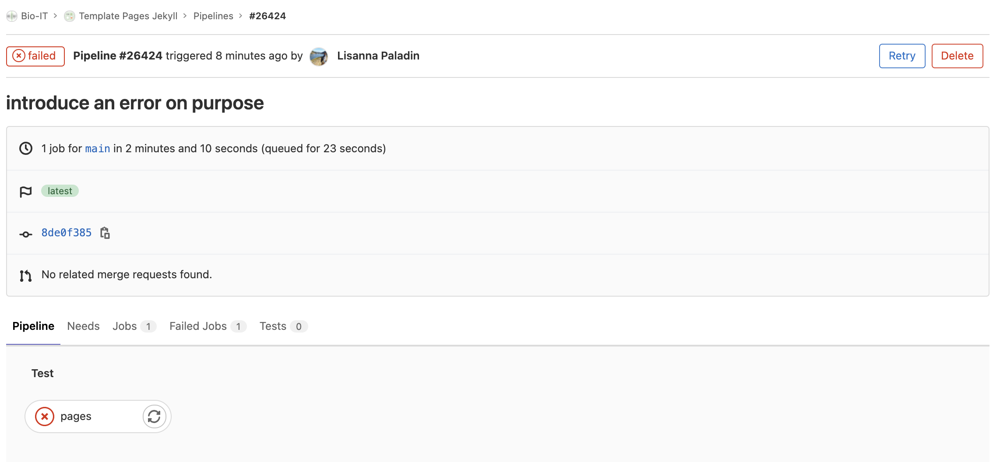

::::::::::::::::::::::::::::::::::::::: objectives

- Get feedback from GitLab about why a pipeline failed

::::::::::::::::::::::::::::::::::::::::::::::::::

:::::::::::::::::::::::::::::::::::::::: questions

- How do I troubleshoot errors in the GitLab pipelines?

::::::::::::::::::::::::::::::::::::::::::::::::::

## When Things Go Wrong

So far we have seen how to successfully use various technologies to produce a website.
There are however some situations where they may fail to do so either due to a typo or missing information. We will go
through one of these cases with a Jekyll example.

::::::::::::::::::::::::::::::::::::::  challenge

## Exercise: Troubleshooting Jekyll

This exercise will help you recognise what common mistakes look like
when working with these elements of a Jekyll website.

Edit your `_config.yml` file and substitute a `:` with a `=` character in one of the variables.

::::::::::::::  solution

## Solution

For instance, `mail=team@carpentries.org` instead of `mail:team@carpentries.org`.

```yaml
description: "This research project develops training materials for reseachers wanting to learn to build project
websites in GitHub with GitHub Pages."
email: "team@carpentries.org"
twitter: "https://twitter.com/thecarpentries
```

If you navigate your GitHub repository you would be able to see something break in `about.md` where we use
`{{ site.twitter }}` however, contrary to what we saw before with invalid Markdown,
Jekyll will refuse to build the website and produce an error message.

We will see after this where to find the error message and identify what caused them.


:::::::::::::::::::::::::

::::::::::::::::::::::::::::::::::::::::::::::::::

If you were keeping an eye on the GitLab pipeline execution page until now (`CI/CD > Pipelines`), you may have noticed
that the once you push the pipeline results "pending", then it starts "running", and eventually it "passes".
Eventually. If it doesn't, then the status is "failed", you may receive an email about it (depending on your GitLab account settings) and you shouldn't panic.
How can we instead understand what caused the error, and fix it? The "failed" status happens to be a button, let's click it.

{alt='click on the failed button to access the pipeline log'}

Once again, you can click on the ❌ <span style="color:red">pages</span> button to access more details, i.e. the
complete log of our pipeline execution. Scroll up the terminal-like window to see how it started, prepared the
environments, installed dependencies and correctly executed until the command `bundle exec jekyll build - public`.
Remember that? It is the command that launches Jekyll, we included it in the `.gitlab-ci.yml` file.

Based on this, we have reasons to suspect that the error here is related to Jekyll being unable to build the page.
Reading more carefully in order to get more details, we find:

```bash 
$ bundle exec jekyll build -d public
                    ------------------------------------------------
      Jekyll 4.2.1   Please append `--trace` to the `build` command
                     for any additional information or backtrace.
                    ------------------------------------------------
/usr/local/bundle/gems/safe_yaml-1.0.5/lib/safe_yaml/load.rb:143:in `parse': (/builds/hpg_ToyM/0/grp-bio-it/template-pages-jekyll/_config.yml): could not find expected ':' while scanning a simple key at line 3 column 1 (Psych::SyntaxError)
```

This means two things: first, the log suggests a way to eventually get more details, i.e. to modify the `.gitlab-ci.yml`
file by adding `--trace` to the command `bundle exec jekyll build -d public`, that thus becomes
`bundle exec jekyll build -d public --trace`. However, we don't really need that: the next sentence is clear enough.
It says, there was an error in parsing the `_config.yml` file because Jekyll could not find the expected `:` character.
Since this typo prevents Jekyll from building the page, the process cannot continue.

::::::::::::::::::::::::::::::::::::::::  callout

## Failure Will Not Remove Your Website

Given the failure you may be wondering what happened to the website?
If you visit the address you will find that the website is still be available.

GitLab will keep your previous version online until the error is fixed
and a new build is completed successfully.


::::::::::::::::::::::::::::::::::::::::::::::::::

We should go back to our `_config.yml` file and fix the `=` error we made (on purpose, this time).
Then push the project again, and problem solved!

:::::::::::::::::::::::::::::::::::::::  challenge

## Exercise: Practice With Troubleshooting Jekyll

Sometimes typos happen and can make your website change in surprising ways.
Let's experiment with some possible issues that might come up and see what happens.

Try the changes listed below on your `index.md` file and see what happens when the page renders.
You will want to correct the previous mistake each time.

1. Use a global or local variable that you didn't define first.
2. Leave the dash off the end of the YAML header.
3. Don't put a space between the YAML header and the rest of the page
4. Put the YAML header in a different location in the page.

:::::::::::::::  solution

## Solution

1. The place where you used the undefined variable is blank but otherwise no error.
  Example:
  
  ```markdown 
  Hi! {{ site.greeting }}. What have you been up to?
  ```

2. The header shows somewhat in the file and the variable that was defined goes to
  the index page intead of the link we set.
  
  ```markdown 
  ---
  lesson-example: "https://carpentries.github.io/lesson-example/"
  
  Examples of our work can be found at: {{ page.lesson-example }}
  ```

3. This doesn't seem to affect our page but can often make more complex pages break.
  
  ```markdown 
  ---
  lesson-example: "https://carpentries.github.io/lesson-example/"
  ---
  Examples of our work can be found at: {{ page.lesson-example }}
  ```

4. This also makes the header somewhat show in the page and breaks the variable link we created.
  
  ```markdown 
  Examples of our work can be found at: {{ page.lesson-example }}
  ---
  lesson-example: "https://carpentries.github.io/lesson-example/"
  ---
  ```

:::::::::::::::::::::::::


Note: Be sure to fix any errors you intentionally introduced in your page before moving on.


::::::::::::::::::::::::::::::::::::::::::::::::::

:::::::::::::::::::::::::::::::::::::::: keypoints

- If a pipeline fails, GitLab will provide you useful feedback on why

::::::::::::::::::::::::::::::::::::::::::::::::::


