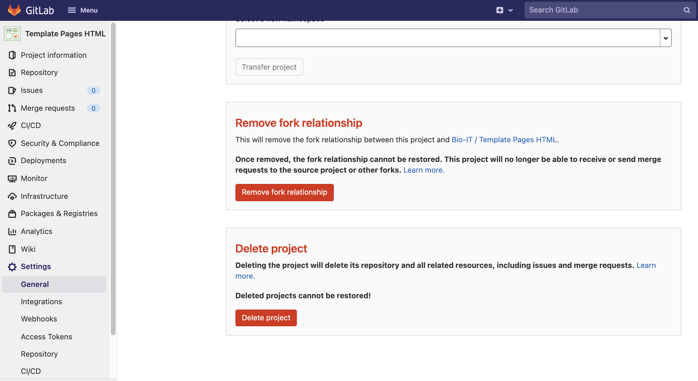

::::::::::::::::::::::::::::::::::::::: objectives

- Find and fork pre-existing templates to determine the technologies behind a project and the styles of the deriving website

::::::::::::::::::::::::::::::::::::::::::::::::::

:::::::::::::::::::::::::::::::::::::::: questions

- Where can I find pre-built projects/themes for my site?

::::::::::::::::::::::::::::::::::::::::::::::::::

## Bio-IT templates

The templates that we developed together are available in our GitLab platform:

- [Plain HTML template](https://git.embl.de/grp-bio-it/template_pages_html)
- [Jekyll template](https://git.embl.de/grp-bio-it/template-pages-jekyll)
- [Sphinx template](https://git.embl.de/grp-bio-it/template-pages-sphinx)
- [Jupyter book](https://git.embl.de/grp-bio-it/template-jupyter-book)

They might be slightly enriched compared to what we went through during this lesson, for example the plain HTML template
also features a `.css` file, but they are kept minimal on purpose. If you want to use them as a base for your own
project, you should **fork** them. If you do so to develop your own project, and not to contribute to the template itself,
you should next **remove the fork relationship**. Let's go through the process together.

{alt='fork a repository through the Fork button'}

Fork a project by clicking the "Fork" button on the right side of the project title. This will open a menu (shown below)
very similar to the one that prompts when you open a new project. You can decide to keep your project private, and edit
the title and description. You can also place it in the relevant group/namespace.

{alt='the fork project menu'}

Once you are done, please remove the fork relationship. You can edit the project settings on the left side menu on the
project page, follow: `Settings > General > Advanced` and then scroll down to the "Remove fork relationship" card.

{alt='remove fork relationship'}

Once this is done, you can clone your repository locally and start editing the template. If you need a recap about
cloning, forking, pushing and pulling in Git please check [this lesson](https://swcarpentry.github.io/git-novice/)
by The Carpentries.

## More templates

Wonder where you can find more examples of GitLab pages projects? Check [this link](https://gitlab.com/pages).
It includes more than 40 examples, based on multiple technologies. Also in those cases, it is good a practice to
remove the fork relationship if your aim is to use the template for the development of your own website, and not to
contribute to the template itself. Some examples of template you will find in this repository are:

- [**courseware-template**](https://gitlab.com/pages/courseware-template), a Jekyll-based template for a course website.
  You can see it in action [here](https://courseware-as-code.gitlab.io/courseware-tutorial/). It includes styles to
  format lecture content, quizzes and slides.
- [**hugo blog template**](https://gitlab.com/pages/hugo), the template to [build blogs](https://pages.gitlab.io/hugo/)
  based on [Hugo](https://gohugo.io/).
- [**jupyterbook**](https://gitlab.com/pages/jupyterbook), a template to generate books and documents integrating Python
  code. See it rendered [here](https://pages.gitlab.io/jupyterbook/intro.html).

Now you have all the expertise required to start playing with GitLab pages. Feel free to
[contact us](mailto:bio-it@embl.de) if you have any question or open an issue in the template projects to request for
features or to raise issues. You are also welcomed to contribute to the development of pages templates, both the ones
existing and new ones that may fit your use cases. Finally, check the next (bonus) chapter to know how to deal with
errors in pipeline execution to be able to troubleshoot eventual CI/CD errors!

:::::::::::::::::::::::::::::::::::::::: keypoints

- You can find many pre-existing templates for sites on the Internet
- You can find the presented themes for sites in our local GitLab
- You can avoid duplicated effort by basing new layouts on previous ones

::::::::::::::::::::::::::::::::::::::::::::::::::

